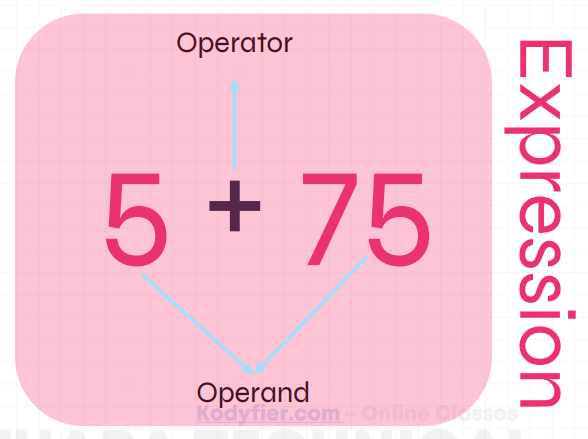
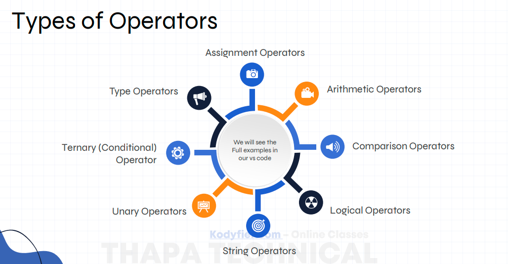
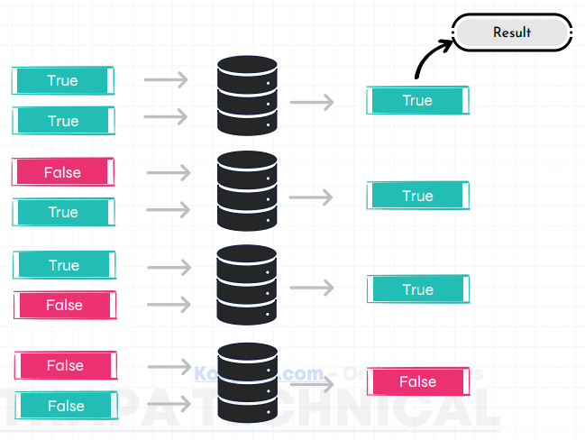
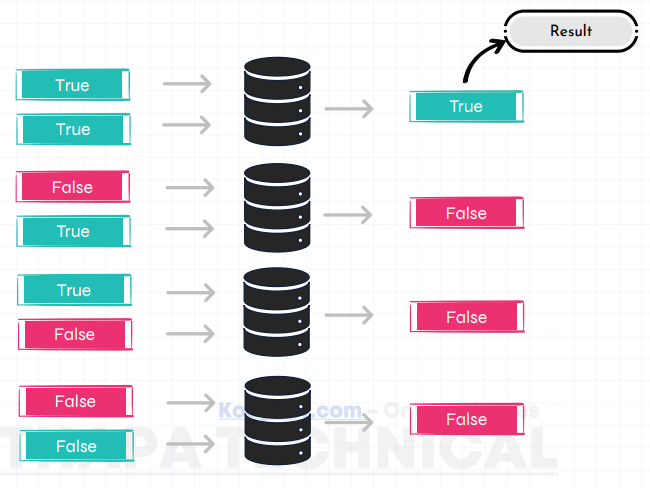

# JavaScript Operators


## Types of Operators
- Arithmetic Operators
- Assignment Operators
- Comparison Operators
- Logical Operators
- Increment / Decrement
- Ternary Operator (Shortcut If-Else)
- Type Operators
- String Operators
- Nullish & Optional (Modern JS 🔥)
- Bitwise Operators (Advanced)



# How Logical OR Operator Works?


# How Logical AND Operator Works?


# 1️⃣ Arithmetic Operators
Used for mathematical calculations.
```JS
let a = 10;
let b = 3;

console.log(a + b);  // 13 (Addition)
console.log(a - b);  // 7  (Subtraction)
console.log(a * b);  // 30 (Multiplication)
console.log(a / b);  // 3.33 (Division)
console.log(a % b);  // 1 (Remainder / Modulus)
console.log(a ** b); // 1000 (Exponent / Power)
```
-----------------------------------------------------------
# 2️⃣ Assignment Operators
Used to assign values to variables.

let x = 10;
```JS
x += 5;  // x = x + 5
x -= 2;  // x = x - 2
x *= 3;  // x = x * 3
x /= 2;  // x = x / 2
x %= 2;  // x = x % 2
```
-----------------------------------------------------------
# 3️⃣ Comparison Operators
Used to compare two values.

Return value is always `true` or `false`.
```JS
let a = 5;
let b = "5";

console.log(a == b);   // true  (only value check)
console.log(a === b);  // false (value + datatype check)
console.log(a != b);   // false
console.log(a !== b);  // true
console.log(a > 3);    // true
console.log(a < 10);   // true
console.log(a >= 5);   // true
console.log(a <= 4);   // false
```
#### 🔥 Important:

- `==` → compares only value

- `===` → compares value + type (recommended)