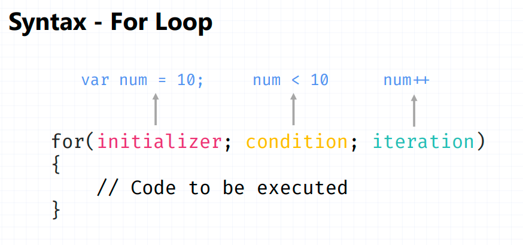
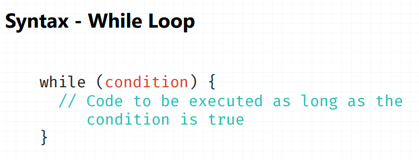
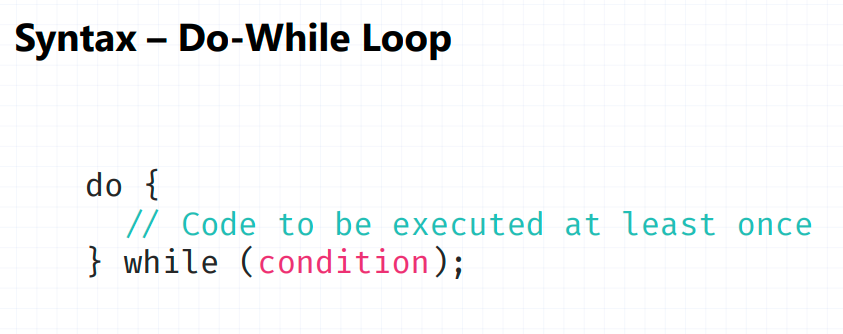

# 🔁 What Are Loops in JavaScript?
A loop is a control structure that allows you to execute a block of code repeatedly until a specified condition becomes false.

Instead of writing the same code many times, loops help you automate repetition.
 
 ----------------------------------------------------------
 # ✅ Why Do We Use Loops?

We use loops when:

- We want to repeat code multiple times

- We want to work with arrays

- We want to process data step by step

- We want to reduce code duplication

-----------------------------------------------------------
# 🔷 Types of Loops in JavaScript
JavaScript has several types of loops:

#### 1. for loop

#### 2. while loop

#### 3. do...while loop

#### 4. for...in loop

#### 5. for...of loop

#### 6. forEach() method (array loop method)

Now let’s understand each one properly.

-----------------------------------------------------------
# 1️⃣ for Loop
### 📘 Definition:

A for loop is used when you know how many times you want to run the loop.



#### 📌 Syntax:
```JS
for (initialization; condition; increment/decrement) {
    // code to execute
}
```
### 🔎 How It Works:

1. Initialization runs first (only once)

2. Condition is checked

3. If true → code runs

4. Increment runs

5. Repeat until condition becomes false

#### ✅ Example 1: Print numbers from 1 to 5
```JS
for (let i = 1; i <= 5; i++) {
    console.log(i);
}
```

#### Output:
```JS
1
2
3
4
5
```
#### 🧠 Flow Explanation:

- i = 1

- 1 <= 5 → true → print 1

- i++

- Repeat until i = 6 → condition false → stop

-----------------------------------------------------------
# 2️⃣ while Loop
### 📘 Definition:

A while loop runs as long as the condition is true.

It is used when you don’t know how many times the loop will run.



#### 📌 Syntax:
```JS
while (condition) {
    // code
}
```
#### ✅ Example:
```JS
let i = 1;

while (i <= 5) {
    console.log(i);
    i++;
}
```
#### Output:
```JS
1
2
3
4
5
```
#### ⚠ Important:

If you forget `i++`, the loop becomes infinite.

Example of infinite loop (Wrong):
```JS
while (true) {
    console.log("Hello");
}
```
-----------------------------------------------------------
# 3️⃣ do...while Loop
### 📘 Definition:

The do...while loop executes the code at least once, even if the condition is false.



#### 📌 Syntax:
```JS
do {
    // code
} while (condition);
```
#### ✅ Example:
```JS
let i = 1;

do {
    console.log(i);
    i++;
} while (i <= 5);
```
#### 🧠 Special Case Example:
```JS
let i = 10;

do {
    console.log(i);
} while (i < 5);
```
#### Output:
```JS
10
```
## 🔷 Difference Between while and do...while
| while |	do...while |
|---------|--------------|
| Condition checked first |	Code runs first |
| May not run at all |	Runs at least once |

-----------------------------------------------------------
# 4️⃣ for...in Loop
### 📘 Definition:

Used to iterate over the properties of an object.

#### 📌 Syntax:
```JS
for (let key in object) {
    // code
}
```
#### ✅ Example:
```JS
let person = {
    name: "Nitish",
    age: 20,
    city: "Delhi"
};

for (let key in person) {
    console.log(key + " : " + person[key]);
}
```
#### Output:
```JS
name : Nitish
age : 20
city : Delhi
```
⚠ Mostly used for objects, not arrays.

-----------------------------------------------------------
-----------------------------------------------------------
# 5️⃣ for...of Loop
### 📘 Definition:

Used to iterate over iterable objects like arrays, strings, etc.

#### 📌 Syntax:
```JS
for (let value of iterable) {
    // code
}
```
#### ✅ Example with Array:
```JS
let numbers = [10, 20, 30];

for (let value of numbers) {
    console.log(value);
}
```
#### Output:
```JS
10
20
30
```
#### ✅ Example with String:
```JS
let text = "JS";

for (let char of text) {
    console.log(char);
}
```
#### Output:
```JS
J
S
```
## 🔷 Difference: for...in vs for...of
| for...in |	for...of |
|--------------|------------|
| Returns keys/index |	Returns values |
| Used for objects |	Used for arrays/strings |

#### Example:
```JS

let arr = ["a", "b", "c"];

for (let i in arr) {
    console.log(i);   // 0 1 2
}

for (let v of arr) {
    console.log(v);   // a b c
}
```
-----------------------------------------------------------
----------------------------------------------------------
# 6️⃣ forEach() Method
### 📘 Definition:

A method used to loop through arrays.
#### 📌 Syntax:
```JS
array.forEach(function(value, index) {
    // code
});
```
#### ✅ Example:
```JS
let numbers = [1, 2, 3];

numbers.forEach(function(value, index) {
    console.log(index + " : " + value);
});
```
#### Output:
```JS
0 : 1
1 : 2
2 : 3
```
-----------------------------------------------------------
-----------------------------------------------------------
# 🔷 Loop Control Statements
## 1️⃣ break

Stops the loop completely.
```JS
for (let i = 1; i <= 5; i++) {
    if (i === 3) {
        break;
    }
    console.log(i);
}
```
#### Output:
```JS
1
2
```
## 2️⃣ continue

Skips the current iteration.
```JS
for (let i = 1; i <= 5; i++) {
    if (i === 3) {
        continue;
    }
    console.log(i);
}
```

#### Output:
```JS
1
2
4
5
```
-----------------------------------------------------------
# 🔥 Nested Loops
A loop inside another loop.
```JS
for (let i = 1; i <= 3; i++) {
    for (let j = 1; j <= 2; j++) {
        console.log(i, j);
    }
}
```
#### Output:
```JS
1 1
1 2
2 1
2 2
3 1
3 2
```